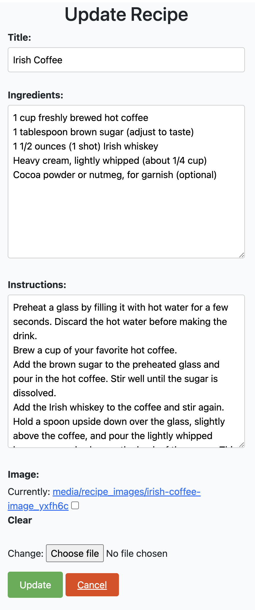

<h1>CookBook Project: What to Eat in Ireland</h1>

The "CookBook Project: What to Eat in Ireland" is a culinary exploration aimed at showcasing the rich and diverse traditional Irish cuisine. The project will compile a comprehensive cookbook that highlights authentic Irish dishes, including beloved classics and lesser-known regional specialties, while also delving into the cultural and historical significance of each recipe. Through this project, food enthusiasts and travelers alike will be able to discover and savor the flavors of Ireland's gastronomic heritage.

## **[Live site](https://cookbook-igor.herokuapp.com/)**

---

## **[Repository](https://github.com/Sergutin/CookBook)**

## Table of contents

* [Technologies Used](#technologies-used)
  * [HTML](#html)
  * [CSS](#css)
  * [Python](#python)
  * [Django](#django)
  * [Bootstrap 5](#bootstrap-5)
  * [Cloudinary](#cloudinary)
  * [Heroku PostgreSQL](#heroku-postgresql)
* [UX Design](#ux-design)
  * [Overview](#overview)
  * [Design](#design)
  * [Website User](#website-user)
  * [Main goals](#main-goals)
* [Agile methodology](#agile-methodology)
* [User Stories](#user-stories)
* [Features](#features)
* [Testing](#testing)
  * [HTML Test](#html-test)
  * [CSS Test](#css-test)
  * [CI Python Linter](#ci-python-linter)
  * [Lighthouse](#lighthouse)
  * [Manual Testing](#manual-testing)
  * [Fixed Bugs](#fixed-bugs)
  * [Unfixed Bugs](#unfixed-bugs)
* [Deployment](#deployment)
  * [Cloning and forking](#cloning-and-forking)
* [Media](#media)

## Technologies Used

  ### HTML
    I used HTML technology to create the user interface and design the visual layout of the web pages. HTML allowed me to structure the content, define headings, paragraphs, and lists, as well as incorporate images, links, and forms, thus enhancing the overall user experience.
    
  ### CSS
    I used CSS (Cascading Style Sheets) technology to enhance the visual presentation of the HTML elements. By applying CSS rules, I could control the fonts, colors, spacing, and overall styling of the web pages. This allowed me to create a cohesive and visually appealing design that complemented the content and improved the user interface.

  ### Python
    I used Python as the primary programming language to build the backend functionality and handle server-side operations.
  ### Django
    I utilized the Django framework to streamline web development tasks and expedite the creation of a robust and scalable web application. With Django, I could easily handle database operations, manage user authentication, and implement complex functionality, saving time and effort in the development process.
  ### Bootstrap 5
    To achieve a responsive and visually appealing front-end design. 
  ### Cloudinary
    I integrated Cloudinary, a cloud-based media management platform, to handle image uploads, storage, and manipulation.
  ### Heroku PostgreSQL
    I deployed and utilized Heroku PostgreSQL as the database management system.

## UX Design

  ### Overview
    The CookBook project is a delightful culinary endeavor focused on capturing the essence of traditional Irish cuisine. It presents a collection of authentic recipes, showcasing beloved Irish dishes passed down through generations. Accompanied by captivating images, this project invites you to explore the rich flavors and cultural heritage of Ireland through its tantalizing recipes.

  ### Design 
    The design of the project features an eye-catching main image that sets the tone for the culinary journey through Irish cuisine. The "Recipes from the Author" section presents a curated selection of traditional Irish dishes, providing insights into their history and preparation. Additionally, the "Your Favorite Recipes" section allows users to contribute and share their own beloved recipes, fostering a sense of community and engagement within the cookbook project.

  ### Website User
    The website user of this project would typically be food enthusiasts, travelers, or individuals with an interest in exploring and experiencing traditional Irish cuisine. They may be looking for authentic recipes, cultural insights, and visual inspiration related to Irish dishes. The project aims to cater to anyone seeking to expand their culinary knowledge and appreciation of Irish food.

  ### Main goals
    Showcase Traditional Irish Cuisine: The website aims to highlight the rich and diverse world of traditional Irish cuisine by featuring a collection of authentic recipes, cultural insights, and historical background. It strives to preserve and promote the unique flavors and culinary heritage of Ireland.

    Inspire and Engage Users: The website aims to inspire and engage users by providing a visually appealing and user-friendly platform where they can discover, learn, and contribute to the culinary journey. Through captivating images, informative content, and the ability to share favorite recipes, the website fosters a sense of community and encourages active participation.

    Provide a Valuable Resource: The website seeks to serve as a valuable resource for food enthusiasts, travelers, and individuals interested in exploring Irish cuisine. It aims to provide reliable and comprehensive information, including detailed recipes, cooking techniques, cultural context, and tips for sourcing authentic ingredients, enabling users to recreate and savor traditional Irish dishes with confidence and authenticity.

## Agile methodology
    The Agile methodology was used in this project to facilitate iterative development, continuous collaboration, and regular feedback loops, ensuring a flexible and adaptive approach to meet the evolving requirements and deliver a high-quality cookbook website.

## User Stories

    To access the user stories, you can simply click on them below. User stories are a way to describe the desired functionality or features from the perspective of the end user. 

 1. [USER STORY: Registration](https://github.com/Sergutin/CookBook/issues/7)
 2. [USER STORY: Log in](https://github.com/Sergutin/CookBook/issues/8)
 3. [USER STORY: Log out](https://github.com/Sergutin/CookBook/issues/5)
 4. [USER STORY: Site pagination](https://github.com/Sergutin/CookBook/issues/9)
 5. [USER STORY: Create recipe](https://github.com/Sergutin/CookBook/issues/10)
 6. [USER STORY: Edit recipe](https://github.com/Sergutin/CookBook/issues/3)
 7. [USER STORY: Delete recipe](https://github.com/Sergutin/CookBook/issues/4)
 8. [USER STORY: Rate / review recipes](https://github.com/Sergutin/CookBook/issues/11)
 9. [USER STORY: Comment](https://github.com/Sergutin/CookBook/issues/2)
 10. [USER STORY: Like and unlike recipes](https://github.com/Sergutin/CookBook/issues/1)

## Features

    User features implemented are as follows:

- Users can register an account

- Users can log into their account

- Users can log out of their account

- Users can view a paginated list of posts

- Users can create a new recipe

- Users can edit their recipes

- Users can delete their recipes

- Users can comment on recipes
- Users can like/unlike recipes

  Furthermore, a notification is provided every time the user performs the following actions:

- User successfully logs in.

- User successfully logs out.

- User successfully creates a recipe.

- User successfully updates the recipe.

- User successfully deletes the recipe.

- There is also User’s confirmation required that they really want to delete the item.

## Testing

    Account Registration Tests
| Test |Result  |
|--|--|
| User can create account | Pass |
| User can log into account | Pass |
| User can log out of account | Pass |

    Site Funstionality Tests
| Test |Result  |
|--|--|
| User can create recipe | Pass |
| User can update recipe | Pass |
| User can delete recipe | Pass |
| User can like recipe | Pass |
| User can comment recipe | Pass |

    Admin Tests
| Test |Result  |
|--|--|
| Admin can approve new user recipe | Pass |
| Admin can delete recipe | Pass |
| Admin can approve new comment | Pass |
| Admin can delete comment | Pass |
| Admin can delete user | Pass |

  ### HTML Test
    !!!!!!!!!!!!!!!!!!!!!!!!!!!!!!!!!!!!!!!

  ### CSS Test
    No errors were found when passing through the official (Jigsaw) CSS validator.

  ### CI Python Linter 
    No errors were found when passing through the CI Python Linter validator.

  ### Lighthouse
    The website was measured using Lighthouse tool, performance 100% was calculated for desktop device:

    and 95-97% for mobile device:

  ### Manual testing
    Responsiveness was tested in different browsers:
<li>Chrome</li>

<li>Safari</li>

<li>Firefox</li>

    Tests were completed in following browsers from mobile device (iOS):
<li>Chrome</li>

<li>Safari</li>

    No broken links found, everything works as expected.

  ### Fixed Bugs
    During bug testing, it was discovered that the .gitignore file was not created, resulting in sensitive information being uploaded to GitHub. To address this issue, I recreated the database on PostgreSQL, updated all credentials in the env.py file and in the Heroku project settings, including the values for DATABASE_URL, SECRET_KEY, and CLOUDINARY_URL.

    During HTML code testing, there were several errors:

  

  ### Unfixed Bugs

There are no known unfixed bugs in the code

## Deployment

The site is deployed using GitHub Pages.

To deploy the site using GitHub Pages:

<ol>
<li>Login or signup to Github.</li>
<li>Go to the repository for this project, https://github.com/Sergutin/CookBook</li>
<li>At the top of the repository, locate the "Settings" button on the menu.</li>
<li>Select "Pages" section in the left hand menu.</li>
<li>From the "Source" dropdown select "Deploy from a Branch". Press "Save".</li>
<li>The site has now been deployed, please note that the process may take a few minutes before the site goes live.</li>
</ol>

  ### Cloning and forking

Forking a repository creates a copy of the original repository on GitHub account.
To fork a repository in GitHub:

<ol>
<li>On GitHub.com, navigate to the repository.</li>
<li>In the top-right corner of the page, click Fork.</li>
<li>Select an owner for the forked repository.</li>
<li>By default, forks are named the same as their parent repositories. You can change the name of the fork to distinguish it further.</li>
<li>Optionally, add a description of your fork.</li>
<li>Choose whether to copy only the default branch or all branches to the new fork. For many forking scenarios, such as contributing to open-source projects, you only need to copy the default branch. By default, only the default branch is copied.</li>
<li>Click Create fork.</li>
</ol>

Cloning a repository creates a copy of the original repository on our local machine.
To clone a repository in GitHub:

<ol>
<li>On GitHub.com, navigate to your fork of the repository.</li>
<li>Above the list of files, click  Code.</li>
<li>Copy the URL for the repository.</li>
<ul>
    <li>To clone the repository using HTTPS, click the "Copy" icon on the right of "HTTPS".</li>
<li>To clone the repository using an SSH key, including a certificate issued by your organization's SSH certificate authority, click SSH, then click the icon on the right to copy it.</li>
  <li>To clone a repository using GitHub CLI, click GitHub CLI, then click the "Copy" icon on the right.</li>
</ul>
</ol>

## Media

The main page image was taken from https://sightwords.com/images/memory/memory.jpg

The back card image of the car was adapted from https://pictures.dealer.com/c/currychevroletscarsdale/1429/5f5b6bc6d929fb8039c58ab125c0f7a7x.jpg?impolicy=downsize&w=568

Car logos were taken from https://similarpng.com/

"You Win" image was taken from https://pbs.twimg.com/media/Fg48ZrfXgAAiPR0?format=jpg&name=large
